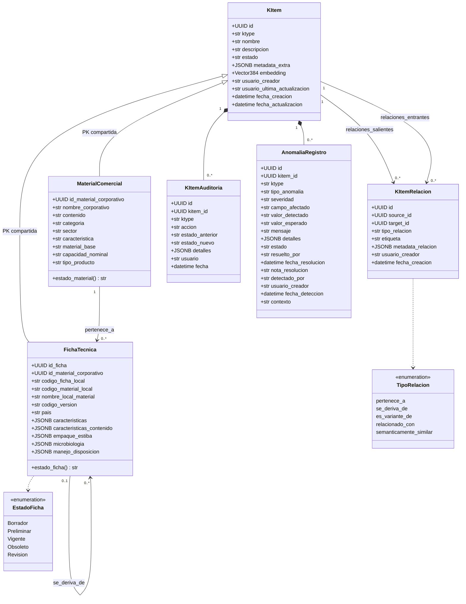
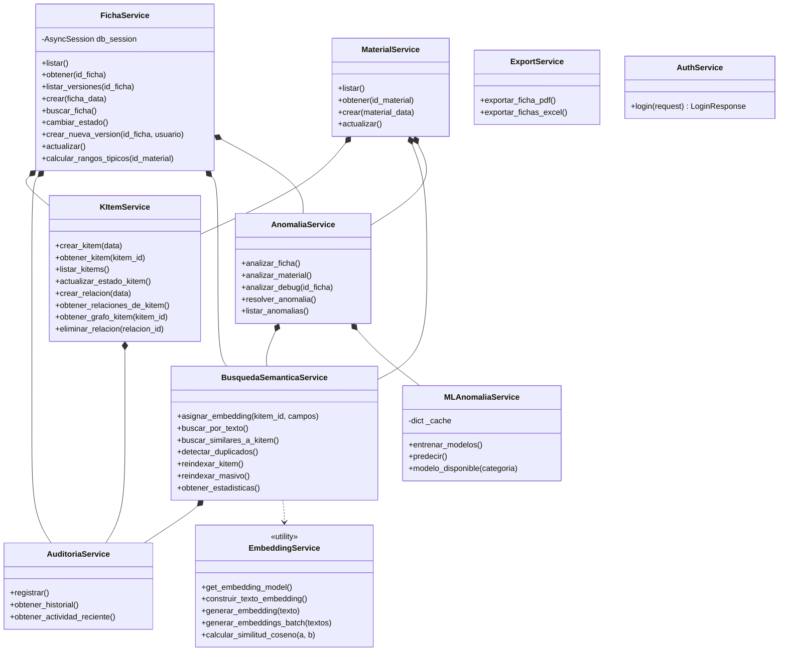

# Insumos para el Diagrama de Clases UML — Molpack DSMS

Inventario extraído del código real (`app/`). Tres capas modelables:

1. **Modelo de dominio / persistencia** (`app/models/`) — 6 clases, el núcleo del diagrama.
2. **Capa de servicios** (`app/services/`) — 9 clases + 1 módulo utilitario.
3. **DTOs / Schemas Pydantic** (`app/schemas/`) — opcional, solo si el diagrama debe cubrir la API.

> Nota: los "enums" listados abajo **no son `enum.Enum` en el código**; son constantes `str`
> en `app/core/dsms_constants.py` y `app/core/anomalia_constant.py`. En UML conviene
> modelarlos como `«enumeration»` porque semánticamente lo son.

---

## 1. Modelo de dominio (entidades persistentes)

### `KItem` — supertipo universal
Tabla `kitem`. Todo objeto de conocimiento ES un k-item.

| Atributo | Tipo | Notas |
|---|---|---|
| `id` | `UUID` | **PK**, default `uuid4` |
| `ktype` | `str` | indexado — discriminador de tipo (`MaterialComercial`, `FichaTecnica`) |
| `nombre` | `str` | |
| `descripcion` | `str [0..1]` | |
| `estado` | `str` | default `"Activo"` |
| `metadata_extra` | `JSONB` | default `{}` |
| `embedding` | `Vector[384] [0..1]` | pgvector, `all-MiniLM-L6-v2` |
| `usuario_creador` | `str` | |
| `usuario_ultima_actualizacion` | `str` | |
| `fecha_creacion` | `datetime` | |
| `fecha_actualizacion` | `datetime` | |

Navegaciones ORM: `relaciones_salientes: KItemRelacion[*]`, `relaciones_entrantes: KItemRelacion[*]`.
Operación: `+__repr__(): str`

Constante de clase: `EMBEDDING_DIMENSION = 384`.

---

### `MaterialComercial` — extensión de KItem
Tabla `material_comercial`. PK compartida con `kitem` (herencia por tabla de clase).

| Atributo | Tipo | Notas |
|---|---|---|
| `id_material_corporativo` | `UUID` | **PK** y **FK → kitem.id** (`ON DELETE CASCADE`) |
| `nombre_corporativo` | `str` | |
| `contenido` | `str [0..1]` | |
| `categoria` | `str [0..1]` | |
| `sector` | `str [0..1]` | |
| `caracteristica` | `str [0..1]` | |
| `material_base` | `str [0..1]` | |
| `capacidad_nominal` | `str [0..1]` | |
| `tipo_producto` | `str [0..1]` | |

Atributos **derivados** (`/`) — proxies de lectura/escritura hacia `kitem`:
`/estado_material: str`, `/fecha_creacion: datetime`, `/fecha_actualizacion: datetime`.

---

### `FichaTecnica` — extensión de KItem
Tabla `ficha_tecnica`. PK compartida con `kitem`.

| Atributo | Tipo | Notas |
|---|---|---|
| `id_ficha` | `UUID` | **PK** y **FK → kitem.id** (`ON DELETE CASCADE`) |
| `id_material_corporativo` | `UUID` | **FK → material_comercial** (no nulo) |
| `codigo_ficha_local` | `str` | |
| `codigo_material_local` | `str` | |
| `nombre_local_material` | `str [0..1]` | |
| `codigo_version` | `str` | |
| `pais` | `str` | |
| `caracteristicas` | `JSONB [0..1]` | sección |
| `caracteristicas_contenido` | `JSONB [0..1]` | sección |
| `empaque_estiba` | `JSONB [0..1]` | sección |
| `microbiologia` | `JSONB [0..1]` | sección |
| `manejo_disposicion` | `JSONB [0..1]` | sección |

Atributos **derivados** (proxies hacia `kitem`):
`/estado_ficha`, `/usuario_creador`, `/usuario_ultima_actualizacion`,
`/fecha_registro` (→ `kitem.fecha_creacion`), `/fecha_actualizacion`.

---

### `KItemRelacion` — grafo de conocimiento (clase asociativa)
Tabla `kitem_relacion`. Arista dirigida entre dos k-items.

| Atributo | Tipo | Notas |
|---|---|---|
| `id` | `UUID` | **PK** |
| `source_id` | `UUID` | **FK → kitem.id**, indexado |
| `target_id` | `UUID` | **FK → kitem.id**, indexado |
| `tipo_relacion` | `str` | indexado — ver `«enum» TipoRelacion` |
| `etiqueta` | `str [0..1]` | |
| `metadata_relacion` | `JSONB` | default `{}` |
| `usuario_creador` | `str` | |
| `fecha_creacion` | `datetime` | |

Operación: `+__repr__(): str`

---

### `KItemAuditoria` — traza de auditoría
Tabla `kitem_auditoria`.

| Atributo | Tipo | Notas |
|---|---|---|
| `id` | `UUID` | **PK** |
| `kitem_id` | `UUID` | **FK → kitem.id** (`ON DELETE SET NULL`), indexado |
| `ktype` | `str` | |
| `accion` | `str` | indexado — ver `«enum» AccionAuditoria` |
| `estado_anterior` | `str [0..1]` | |
| `estado_nuevo` | `str [0..1]` | |
| `detalles` | `JSONB` | default `{}` |
| `usuario` | `str` | |
| `fecha` | `datetime` | indexado |

---

### `AnomaliaRegistro` — histórico de anomalías
Tabla `anomalia_registro`.

| Atributo | Tipo | Notas |
|---|---|---|
| `id` | `UUID` | **PK** |
| `kitem_id` | `UUID` | **FK → kitem.id** (`CASCADE`), indexado |
| `ktype` | `str` | |
| `tipo_anomalia` | `str` | indexado — ver `«enum» TipoAnomalia` |
| `severidad` | `str` | indexado, default `"advertencia"` |
| `campo_afectado` | `str [0..1]` | |
| `valor_detectado` | `str [0..1]` | |
| `valor_esperado` | `str [0..1]` | |
| `mensaje` | `str` | |
| `detalles` | `JSONB` | default `{}` |
| `estado` | `str` | indexado, default `"pendiente"` |
| `resuelto_por` | `str [0..1]` | |
| `fecha_resolucion` | `datetime [0..1]` | |
| `nota_resolucion` | `str [0..1]` | |
| `detectado_por` | `str` | default `"sistema"` |
| `usuario_creador` | `str` | |
| `fecha_deteccion` | `datetime` | indexado |
| `contexto` | `str` | default `"creacion"` |

---

## 2. Relaciones y multiplicidades (dominio)

| Origen | Relación UML | Destino | Multiplicidad | Implementación |
|---|---|---|---|---|
| `KItem` | generalización (PK compartida) | `MaterialComercial` | `1 ── 0..1` | FK = PK a `kitem.id` |
| `KItem` | generalización (PK compartida) | `FichaTecnica` | `1 ── 0..1` | FK = PK a `kitem.id` |
| `MaterialComercial` | asociación `pertenece_a` | `FichaTecnica` | `1 ── 0..*` | `ficha_tecnica.id_material_corporativo` |
| `KItem` (source) | asociación dirigida | `KItemRelacion` | `1 ── 0..*` | `relaciones_salientes` |
| `KItem` (target) | asociación dirigida | `KItemRelacion` | `1 ── 0..*` | `relaciones_entrantes` |
| `KItem` | composición | `KItemAuditoria` | `1 ── 0..*` | `kitem_auditoria.kitem_id` |
| `KItem` | composición | `AnomaliaRegistro` | `1 ── 0..*` | `anomalia_registro.kitem_id` |
| `FichaTecnica` | auto-asociación `se_deriva_de` | `FichaTecnica` | `0..1 ── 0..*` | vía `KItemRelacion` (versionamiento) |
| `MaterialComercial` | auto-asociación `es_variante_de` | `MaterialComercial` | `0..* ── 0..*` | vía `KItemRelacion` |

**Decisión de modelado:** `KItem`→`MaterialComercial`/`FichaTecnica` se puede dibujar como
**generalización** (es lo que el código expresa: "un material *es un* k-item") o como
**composición 1..1** si prefieres reflejar que en SQLAlchemy no hay herencia declarativa sino
dos tablas unidas por PK compartida. La generalización comunica mejor la intención del patrón K-Item.

---

## 3. Enumeraciones

```
«enumeration» EstadoFicha        : Borrador, Preliminar, Vigente, Obsoleto, Revisión
«enumeration» KType              : MaterialComercial, FichaTecnica
«enumeration» TipoRelacion       : pertenece_a, se_deriva_de, es_variante_de,
                                   relacionado_con, semanticamente_similar
«enumeration» AccionAuditoria    : CREACION, CAMBIO_ESTADO, MODIFICACION,
                                   RELACION_CREADA, RELACION_ELIMINADA,
                                   NUEVA_VERSION, EMBEDDING_GENERADO
«enumeration» TipoAnomalia       : rango_categoria, valor_atipico, unidad_inconsistente,
                                   clasificacion_cruzada, duplicado_semantico,
                                   estructura_invalida, perfil_numerico_cruzado,
                                   atipico_multivariado
«enumeration» Severidad          : informativa, advertencia, critica
«enumeration» EstadoAnomalia     : pendiente, aceptada, descartada, corregida
«enumeration» ContextoDeteccion  : creacion, actualizacion, analisis_batch
```

### Máquina de estados de `FichaTecnica` (`TRANSACCIONES_PERMITIDAS`)

```
Borrador    → Preliminar, Obsoleto
Preliminar  → Vigente, Obsoleto
Vigente     → Obsoleto
Obsoleto    → Revisión
Revisión    → Preliminar, Obsoleto
```
Abreviaturas usadas en códigos: BOR, PRE, VIG, OBS, REV.

---

## 4. Capa de servicios

Todas reciben `AsyncSession` por constructor (inyectada desde `app/core/deps.py`).
Las dependencias entre servicios son **composición** (se instancian en `__init__`).

### `FichaService`
- Atributos: `db_session`, `kitem_service: KItemService`, `auditoria: AuditoriaService`, `busqueda: BusquedaSemanticaService`, `anomalias: AnomaliaService`
- Públicas: `listar()`, `obtener(id_ficha)`, `listar_versiones(id_ficha)`, `crear(ficha_data)`, `buscar_ficha(...)`, `cambiar_estado(...)`, `crear_nueva_version(id_ficha, usuario)`, `actualizar(...)`, `calcular_rangos_tipicos(id_material)`
- Privadas relevantes: `_validar_transicion_estado`, `_validar_para_preliminar`, `_validar_para_vigente`, `_validar_unica_vigente_por_material_pais`, `_validar_material`, `_validar_contenido_por_tipo`, `_validar_codigo_material_local_unico`, `_generar_codigo_ficha`, `_incrementar_version_simple`, `_modificar_ficha_editable`, `_modificar_ficha_vigente`

### `MaterialService`
- Atributos: `db_session`, `kitem_service`, `busqueda`, `anomalia_service`
- Públicas: `listar()`, `obtener(id_material)`, `crear(material_data)`, `actualizar(...)`
- Privada: `_campos_embedding(material)`

### `KItemService`
- Atributos: `db_session`, `auditoria: AuditoriaService`
- Públicas: `crear_kitem(data)`, `obtener_kitem(kitem_id)`, `listar_kitems(...)`, `actualizar_estado_kitem(...)`, `crear_relacion(data)`, `obtener_relaciones_de_kitem(...)`, `obtener_grafo_kitem(kitem_id)`, `eliminar_relacion(relacion_id)`

### `AuditoriaService`
- Atributos: `db_session`
- Públicas: `registrar(...)`, `obtener_historial(...)`, `obtener_actividad_reciente(...)`

### `BusquedaSemanticaService`
- Atributos: `db_session`, `auditoria`
- Públicas: `asignar_embedding(kitem_id, campos_adicionales)`, `buscar_por_texto(...)`, `buscar_similares_a_kitem(...)`, `detectar_duplicados(...)`, `reindexar_kitem(...)`, `reindexar_masivo(...)`, `obtener_estadisticas()`

### `AnomaliaService`
- Atributos: `db_session`, `busqueda: BusquedaSemanticaService`, `ml: MLAnomaliaService`
- Públicas: `analizar_ficha(...)`, `analizar_material(...)`, `analizar_debug(id_ficha)`, `resolver_anomalia(...)`, `listar_anomalias(...)`
- Detectores privados: `_detectar_valores_atipicos`, `_detectar_unidades_inconsistentes`, `_detectar_duplicados_semanticos`, `_detectar_clasificacion_cruzada`, `_detectar_perfil_numerico_cruzado`, `_detectar_ml_multivariado`, `_detectar_rango_categoria`, `_persistir_anomalia`

### `MLAnomaliaService`
- Atributos: `db`, `_cache: dict[str, dict]`
- Públicas: `entrenar_modelos()`, `predecir(...)`, `modelo_disponible(categoria)`
- Privadas: `_entrenar_y_guardar`, `_cargar_modelo`

### `ExportService`
- Atributos: `db_session`
- Públicas: `exportar_ficha_pdf(...)`, `exportar_fichas_excel()`
- Privadas: helpers de dibujo ReportLab (`_generar_overlay`, `_dibujar_cabecera`, `_merge_con_plantilla`, …)

### `AuthService`
- Sin estado (no define `__init__`)
- Públicas: `login(request: LoginRequest): LoginResponse`
- Privadas: `_autenticar_local`, `_autenticar_ldap`

### `«module» embedding_service` (funciones, no clase)
`get_embedding_model()`, `construir_texto_embedding(...)`, `generar_embedding(texto)`,
`generar_embeddings_batch(textos, batch_size)`, `calcular_similitud_coseno(vec_a, vec_b)`
→ modelar como clase `«utility»` si el diagrama lo requiere.

### `RateLimiter` (`app/core/security.py`)
- Públicas: `verificar(ip)`, `registrar_intento(ip, exitoso)`, `get_intentos_restantes(ip)`

### Dependencias entre servicios (para el diagrama de composición)

```
FichaService    ──▶ KItemService, AuditoriaService, BusquedaSemanticaService, AnomaliaService
MaterialService ──▶ KItemService, BusquedaSemanticaService, AnomaliaService
KItemService    ──▶ AuditoriaService
BusquedaSemanticaService ──▶ AuditoriaService, «module» embedding_service
AnomaliaService ──▶ BusquedaSemanticaService, MLAnomaliaService
```

---

## 5. Routers (si incluyes la capa de presentación)

| Router | Prefijo | Servicio principal |
|---|---|---|
| `auth.py` | `/auth` | `AuthService` |
| `ficha.py` | `/ficha` | `FichaService` |
| `imagenes.py` | `/ficha` | — (I/O de archivos) |
| `material.py` | `/material` | `MaterialService` |
| `anomalia.py` | `/anomalias` | `AnomaliaService`, `MLAnomaliaService` |
| `dsms.py` | `/dsms` | `KItemService` |
| `auditoria.py` | `/dsms/auditoria` | `AuditoriaService` |
| `semantic_search.py` | `/dsms/semantica` | `BusquedaSemanticaService` |
| `export.py` | `/export` | `ExportService` |

---

## 6. DTOs / Schemas Pydantic (opcional)

- **ficha.py**: `CaracteristicasSchema`, `CaracteristicasContenidoSchema`, `EmpaqueEstibaSchema`, `MicrobiologiaSchema`, `ManejoDisposicionSchema`, `AnomaliaResumen`, `FichaTecnicaSchema`, `FichaTecnicaCreateSchema`, `FichaTecnicaUpdateSchema`, `FichaTecnicaWithMaterialSchema`, `FichaVersionSchema`, `CambioEstadoRequest`
- **material.py**: `MaterialCreateSchema`, `AnomaliaResumen`, `MaterialSchema`, `MaterialLiteSchema`, `MaterialUpdateSchema`, `CambioEstadoMaterialRequest`
- **kitem.py**: `KItemCreateSchema`, `KItemSchema`, `KItemLiteSchema`
- **kitem_relacion.py**: `KItemRelacionCreateSchema`, `KItemRelacionSchema`, `KItemRelacionDetalleSchema`
- **kitem_auditoria.py**: `AuditoriaSchema`, `AuditoriaResumenSchema`
- **anomalia.py**: `AnomaliaDetectada`, `ResultadoAnalisis`, `AnalizarFichaRequest`, `AnalizarMaterialRequest`, `ResolverAnomaliaRequest`, `AnomaliaRegistroSchema`, `AnomaliaListResponse`
- **semantic_search.py**: `BusquedaSemanticaRequest`, `DeteccionDuplicadosRequest`, `ReindexacionMasivaRequest`, `KItemBusquedaSchema`, `ResultadoBusquedaSchema`, `BusquedaSemanticaResponse`, `DeteccionDuplicadosResponse`, `ReindexacionResponse`, `EstadisticasEmbeddingKtype`, `EstadisticasEmbeddingResponse`
- **auth_service.py** (definidos junto al servicio): `LoginRequest`, `LoginResponse`

Las cinco secciones JSONB de `FichaTecnica` (`caracteristicas`, `caracteristicas_contenido`,
`empaque_estiba`, `microbiologia`, `manejo_disposicion`) pueden dibujarse como
**composiciones 1 ── 0..1** hacia sus schemas correspondientes, marcadas `«JSONB»`.

---

## 7. Diagrama base en Mermaid (listo para pegar)



### Diagrama de servicios en Mermaid


